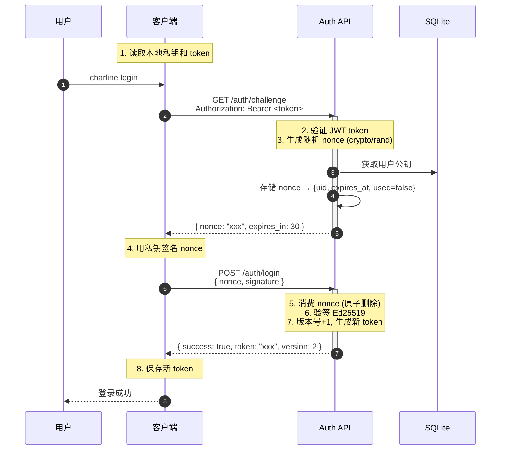

# Phase 2.1: Nonce 签名登录

> 实现 `/auth login` 命令，基于 Ed25519 PoP（Proof of Possession）认证
>
> 参考: `charline_jwt_ed25519_auth.md` (JWT + Ed25519 认证方案)

---

## 一、背景与目标

### 1.1 为什么需要 Nonce 签名登录

Phase 2 完成了首次加入（/join）流程，用户获得 JWT Token。但仅持有 Token 不能证明用户拥有对应私钥：

- Token 泄露 → 他人可以冒充登录
- 没有绑定设备 → 无法验证用户身份

Phase 2.1 引入 **Ed25519 Proof of Possession (PoP)** 机制：

- JWT 声明身份（我是谁）
- Ed25519 私钥证明所有权（我拥有对应的私钥）

### 1.2 目标

实现同设备重连的认证流程：

```
目标: 已有本地凭证的用户，通过 Nonce 签名完成身份验证
结果: 获得新的 JWT Token（版本号递增）
```

---

## 二、认证流程设计

### 2.1 完整流程图

```
Client                                      Server
  |                                            |
  | 1. 读取本地私钥和 token                     |
  |                                            |
  | 2. GET /api/v1/auth/challenge   ---------> |
  |    Header: Authorization: Bearer <token>   |
  |                                            |
  |                               3. 验证 token |
  |                               4. 生成随机 nonce |
  |                                  - crypto/rand |
  |                                  - 16-32 字节 |
  |                                  - 5-30 秒过期 |
  |                                            |
  | 5. 返回 { nonce, expires_in } <----------- |
  |                                            |
  | 6. 用私钥签名 nonce                         |
  |    signature = Sign(private_key, nonce)    |
  |                                            |
  | 7. POST /api/v1/auth/login    ------------> |
  |    { nonce, signature }                    |
  |                                            |
  |                          8. 从 JWT 取 uid  |
  |                          9. 从 DB 取 public_key |
  |                          10. Verify(pubkey, nonce, sig) |
  |                          11. 检查 nonce 未使用（原子删除） |
  |                          12. 版本号 +1，生成新 token |
  |                                            |
  | 13. 返回 { success, new_token, version } < |
  |                                            |
  | 14. 保存 new_token                          |
```

### 2.2 时序图



---

## 三、客户端实现

### 3.1 目录结构

```
client/internal/
├── auth/
│   └── signer.go          # 已有：Nonce 签名器
├── store/
│   ├── credential.go       # 已有：凭证存储
│   └── token.go            # 新增：Token 管理
└── commands/
    ├── join.go             # 已有：/join 命令
    └── login.go            # 新增：/auth login 命令
```

### 3.2 新增文件

#### 3.2.1 `client/internal/store/token.go`

```go
package store

import (
    "os"
    "path/filepath"
)

// TokenPath 返回 token 文件路径 (~/.charline/token.jwt)
func TokenPath() string {
    return filepath.Join(GetCharlineDir(), "token.jwt")
}

// LoadToken 从文件加载 JWT token
func LoadToken() (string, error) {
    data, err := os.ReadFile(TokenPath())
    if err != nil {
        return "", err
    }
    return string(data), nil
}

// SaveToken 保存 JWT token 到文件
func SaveToken(token string) error {
    return os.WriteFile(TokenPath(), []byte(token), 0644)
}
```

#### 3.2.2 `client/internal/commands/login.go`

```go
package commands

import (
    "bytes"
    "encoding/json"
    "fmt"
    "io"
    "net/http"
    "time"

    "github.com/LucienVen/charline/client/internal/auth"
    "github.com/LucienVen/charline/client/internal/store"
)

// LoginConfig 登录命令配置
type LoginConfig struct {
    ServerURL string
}

// LoginResult 登录结果
type LoginResult struct {
    Token   string
    Version int
}

// ChallengeResponse Challenge API 响应
type ChallengeResponse struct {
    Code    int    `json:"code"`
    Message string `json:"message"`
    Data    struct {
        Nonce      string `json:"nonce"`
        ExpiresIn  int    `json:"expires_in"`
    } `json:"data"`
}

// LoginResponse Login API 响应
type LoginResponse struct {
    Code    int    `json:"code"`
    Message string `json:"message"`
    Data    struct {
        Token   string `json:"token"`
        Version int    `json:"version"`
    } `json:"data"`
}

// Login 执行登录流程
func Login(cfg *LoginConfig) (*LoginResult, error) {
    // 1. 检查本地凭证是否存在
    if !store.HasCredential() {
        return nil, fmt.Errorf("未找到本地凭证，请先执行 join")
    }

    // 2. 加载本地私钥
    kp, err := auth.Load()
    if err != nil {
        return nil, fmt.Errorf("加载私钥失败: %w", err)
    }

    // 3. 加载 JWT token
    token, err := store.LoadToken()
    if err != nil {
        return nil, fmt.Errorf("加载 token 失败: %w", err)
    }

    // 4. 调用 GET /challenge
    challengeResp, err := doChallengeRequest(cfg.ServerURL, token)
    if err != nil {
        return nil, fmt.Errorf("获取 challenge 失败: %w", err)
    }

    // 5. 签名 nonce
    signer := auth.NewSigner(kp)
    signature, err := signer.Sign(challengeResp.Data.Nonce)
    if err != nil {
        return nil, fmt.Errorf("签名失败: %w", err)
    }

    // 6. 调用 POST /login
    loginResp, err := doLoginRequest(cfg.ServerURL, challengeResp.Data.Nonce, signature)
    if err != nil {
        return nil, fmt.Errorf("登录失败: %w", err)
    }

    // 7. 保存新 token
    if err := store.SaveToken(loginResp.Data.Token); err != nil {
        return nil, fmt.Errorf("保存 token 失败: %w", err)
    }

    return &LoginResult{
        Token:   loginResp.Data.Token,
        Version: loginResp.Data.Version,
    }, nil
}

// doChallengeRequest 发送 challenge 请求
func doChallengeRequest(serverURL, token string) (*ChallengeResponse, error) {
    url := fmt.Sprintf("%s/api/v1/auth/challenge", serverURL)
    req, err := http.NewRequest("GET", url, nil)
    if err != nil {
        return nil, err
    }
    req.Header.Set("Authorization", "Bearer "+token)

    client := &http.Client{Timeout: 10 * time.Second}
    resp, err := client.Do(req)
    if err != nil {
        return nil, err
    }
    defer resp.Body.Close()

    body, err := io.ReadAll(resp.Body)
    if err != nil {
        return nil, err
    }

    var result ChallengeResponse
    if err := json.Unmarshal(body, &result); err != nil {
        return nil, err
    }

    if result.Code != 0 {
        return nil, fmt.Errorf("challenge 失败: %s", result.Message)
    }

    return &result, nil
}

// doLoginRequest 发送 login 请求
func doLoginRequest(serverURL, nonce, signature string) (*LoginResponse, error) {
    url := fmt.Sprintf("%s/api/v1/auth/login", serverURL)
    body := map[string]string{
        "nonce":     nonce,
        "signature": signature,
    }
    jsonBody, _ := json.Marshal(body)

    req, err := http.NewRequest("POST", url, bytes.NewBuffer(jsonBody))
    if err != nil {
        return nil, err
    }
    req.Header.Set("Content-Type", "application/json")

    client := &http.Client{Timeout: 10 * time.Second}
    resp, err := client.Do(req)
    if err != nil {
        return nil, err
    }
    defer resp.Body.Close()

    respBody, err := io.ReadAll(resp.Body)
    if err != nil {
        return nil, err
    }

    var result LoginResponse
    if err := json.Unmarshal(respBody, &result); err != nil {
        return nil, err
    }

    if result.Code != 0 {
        return nil, fmt.Errorf("登录失败: %s", result.Message)
    }

    return &result, nil
}
```

### 3.3 `client/cmd/main.go` 修改

```go
// 在 switch-case 中添加
case "login", "auth":
    log.Info("Auth login command")
    handleAuthLogin(log, cfg, cmdArgs)

case "join":
    // 已有

// 添加新函数
func handleAuthLogin(log *pkglogger.Logger, cfg *config.Config, args []string) {
    // 验证参数
    if len(args) > 0 && args[0] == "--force" {
        // 强制重新登录（暂不实现）
    }

    log.Info("Executing login command")

    result, err := commands.Login(&commands.LoginConfig{
        ServerURL: cfg.ServerURL,
    })
    if err != nil {
        log.Error("Login failed", zap.Error(err))
        fmt.Fprintf(os.Stderr, "登录失败: %v\n", err)
        os.Exit(1)
    }

    log.Info("Login successful", zap.Int("version", result.Version))
    fmt.Printf("✓ 登录成功！\n")
    fmt.Printf("  凭证版本: %d\n", result.Version)
}
```

---

## 四、服务端实现

### 4.1 新增文件

#### 4.1.1 `server/internal/store/nonce_store.go`

```go
package store

import (
    "crypto/rand"
    "encoding/base64"
    "sync"
    "time"
)

// NonceEntry Nonce 存储条目
type NonceEntry struct {
    UserID    string
    ExpiresAt time.Time
    Used      bool
}

// NonceStore Nonce 内存存储（防重放）
type NonceStore struct {
    mu   sync.RWMutex
    data map[string]NonceEntry
}

// NewNonceStore 创建 Nonce 存储
func NewNonceStore() *NonceStore {
    return &NonceStore{
        data: make(map[string]NonceEntry),
    }
}

// Generate 生成新的 nonce
// 长度: 32 字节 (Base64 后 ~44 字符)
// 过期: 30 秒
func (s *NonceStore) Generate(userID string) (string, error) {
    // 生成随机字节
    randBytes := make([]byte, 32)
    if _, err := io.ReadFull(rand.Reader, randBytes); err != nil {
        return "", err
    }
    nonce := base64.StdEncoding.EncodeToString(randBytes)

    // 存储
    s.mu.Lock()
    s.data[nonce] = NonceEntry{
        UserID:    userID,
        ExpiresAt: time.Now().Add(30 * time.Second),
        Used:      false,
    }
    s.mu.Unlock()

    return nonce, nil
}

// Consume 消费 nonce（原子操作，验证后删除）
func (s *NonceStore) Consume(nonce string) (*NonceEntry, bool) {
    s.mu.Lock()
    defer s.mu.Unlock()

    entry, exists := s.data[nonce]
    if !exists {
        return nil, false // 不存在或已使用
    }

    if entry.Used {
        return nil, false
    }

    if time.Now().After(entry.ExpiresAt) {
        delete(s.data, nonce)
        return nil, false // 已过期
    }

    // 标记为已使用并删除
    entry.Used = true
    delete(s.data, nonce)

    return &entry, true
}

// Cleanup 清理过期 nonce（定期调用）
func (s *NonceStore) Cleanup() {
    s.mu.Lock()
    defer s.mu.Unlock()

    now := time.Now()
    for nonce, entry := range s.data {
        if now.After(entry.ExpiresAt) {
            delete(s.data, nonce)
        }
    }
}
```

#### 4.1.2 `server/internal/service/auth_service.go`

```go
package service

import (
    "encoding/base64"
    "errors"

    "github.com/LucienVen/charline/server/internal/auth"
    "github.com/LucienVen/charline/server/internal/errors"
    "github.com/LucienVen/charline/server/internal/store"
)

// AuthService 认证服务
type AuthService struct {
    jwtManager  *auth.JwtManager
    userStore   *UserStore
    nonceStore  *store.NonceStore
}

// NewAuthService 创建认证服务
func NewAuthService(jwtManager *auth.JwtManager, userStore *UserStore, nonceStore *store.NonceStore) *AuthService {
    return &AuthService{
        jwtManager:  jwtManager,
        userStore:   userStore,
        nonceStore:  nonceStore,
    }
}

// ChallengeResult Challenge 响应
type ChallengeResult struct {
    Nonce     string
    ExpiresIn int
}

// GetChallenge 获取挑战
func (s *AuthService) GetChallenge(tokenString string) (*ChallengeResult, *apperrors.BizError) {
    // 验证 token
    claims, err := s.jwtManager.ValidateToken(tokenString)
    if err != nil {
        return nil, apperrors.ErrTokenInvalid
    }

    // 生成 nonce
    nonce, err := s.nonceStore.Generate(claims.UserID)
    if err != nil {
        return nil, apperrors.ErrSystemError.WrapError(err)
    }

    return &ChallengeResult{
        Nonce:     nonce,
        ExpiresIn: 30, // 30 秒
    }, nil
}

// LoginResult Login 响应
type LoginResult struct {
    Token   string
    Version int
}

// Login 登录验证
func (s *AuthService) Login(nonce, signature string) (*LoginResult, *apperrors.BizError) {
    // 消费 nonce
    entry, ok := s.nonceStore.Consume(nonce)
    if !ok {
        return nil, apperrors.ErrInvalidNonce.WithDetail("reason", "nonce 不存在、已使用或已过期")
    }

    // 从数据库获取用户公钥
    user, err := s.userStore.GetByUserID(entry.UserID)
    if err != nil {
        return nil, apperrors.ErrUserNotFound
    }

    // 验签
    pubKeyBytes, err := base64.StdEncoding.DecodeString(user.PublicKey)
    if err != nil {
        return nil, apperrors.ErrInvalidPublicKey.WrapError(err)
    }

    if !verifySignature(pubKeyBytes, []byte(nonce), signature) {
        return nil, apperrors.ErrSignatureInvalid
    }

    // 生成新 token（版本号递增）
    newVersion := claims.Version + 1
    newToken, err := s.jwtManager.GenerateToken(claims.Username, newVersion)
    if err != nil {
        return nil, apperrors.ErrTokenGenerationFailed.WrapError(err)
    }

    return &LoginResult{
        Token:   newToken,
        Version: newVersion,
    }, nil
}

// verifySignature 验证 Ed25519 签名
func verifySignature(pubKey, message []byte, signatureBase64 string) bool {
    signature, err := base64.StdEncoding.DecodeString(signatureBase64)
    if err != nil {
        return false
    }

    return ed25519.Verify(pubKey, message, signature)
}
```

#### 4.1.3 `server/internal/controller/auth_controller.go`

```go
package controller

import (
    "encoding/json"
    "net/http"
    "strings"

    "github.com/LucienVen/charline/server/internal/service"
    "github.com/go-chi/chi/v5"
)

// AuthController 认证控制器
type AuthController struct {
    authService *service.AuthService
}

// NewAuthController 创建认证控制器
func NewAuthController(authService *service.AuthService) *AuthController {
    return &AuthController{
        authService: authService,
    }
}

// ChallengeRequest GET /auth/challenge
func (c *AuthController) Challenge(w http.ResponseWriter, r *http.Request) {
    // 从 Header 获取 Authorization
    authHeader := r.Header.Get("Authorization")
    if authHeader == "" {
        writeError(w, http.StatusUnauthorized, 401, "Missing Authorization header")
        return
    }

    if !strings.HasPrefix(authHeader, "Bearer ") {
        writeError(w, http.StatusUnauthorized, 401, "Invalid Authorization format")
        return
    }

    token := authHeader[7:]

    // 获取 challenge
    result, bizErr := c.authService.GetChallenge(token)
    if bizErr != nil {
        writeBizError(w, bizErr)
        return
    }

    writeSuccess(w, map[string]interface{}{
        "nonce":      result.Nonce,
        "expires_in": result.ExpiresIn,
    })
}

// LoginRequest POST /auth/login
type LoginRequest struct {
    Nonce     string `json:"nonce"`
    Signature string `json:"signature"`
}

// Login POST /auth/login
func (c *AuthController) Login(w http.ResponseWriter, r *http.Request) {
    var req LoginRequest
    if err := json.NewDecoder(r.Body).Decode(&req); err != nil {
        writeError(w, http.StatusBadRequest, 400, "Invalid request body")
        return
    }

    if req.Nonce == "" {
        writeError(w, http.StatusBadRequest, 400, "nonce is required")
        return
    }

    if req.Signature == "" {
        writeError(w, http.StatusBadRequest, 400, "signature is required")
        return
    }

    // 登录验证
    result, bizErr := c.authService.Login(req.Nonce, req.Signature)
    if bizErr != nil {
        writeBizError(w, bizErr)
        return
    }

    writeSuccess(w, map[string]interface{}{
        "token":   result.Token,
        "version": result.Version,
    })
}

// Routes 注册路由
func (c *AuthController) Routes(r chi.Router) {
    r.Get("/auth/challenge", c.Challenge)
    r.Post("/auth/login", c.Login)
}

// Helper functions
func writeSuccess(w http.ResponseWriter, data interface{}) {
    w.Header().Set("Content-Type", "application/json")
    w.WriteHeader(http.StatusOK)
    json.NewEncoder(w).Encode(map[string]interface{}{
        "code":    0,
        "message": "success",
        "data":    data,
    })
}

func writeError(w http.ResponseWriter, status int, code int, message string) {
    w.Header().Set("Content-Type", "application/json")
    w.WriteHeader(status)
    json.NewEncoder(w).Encode(map[string]interface{}{
        "code":    code,
        "message": message,
    })
}

func writeBizError(w http.ResponseWriter, bizErr *apperrors.BizError) {
    status := http.StatusInternalServerError
    if bizErr.Code == 3001 || bizErr.Code == 3002 {
        status = http.StatusUnauthorized
    }
    writeError(w, status, bizErr.Code, bizErr.Message)
}

var _ = apperrors.ErrSystemError
```

### 4.2 修改文件

#### 4.2.1 `server/internal/router/router.go`

```go
// 在 NewRouter 中添加
func NewRouter(container *container.Container, log *logger.Logger) *chi.Mux {
    r := chi.NewRouter()

    // Health check
    r.Get("/health", func(w http.ResponseWriter, r *http.Request) {
        w.Write([]byte("OK"))
    })

    // API v1
    r.Route("/api/v1", func(r chi.Router) {
        // Invite endpoints
        r.Mount("/invite", container.InviteController.Routes(chi.NewRouter()))

        // Auth endpoints (新增)
        r.Mount("/auth", container.AuthController.Routes(chi.NewRouter()))
    })

    return r
}
```

#### 4.2.2 `server/internal/container/container.go`

```go
// 添加 AuthController 到 Container
type Container struct {
    InviteController *controller.InviteController
    AuthController   *controller.AuthController  // 新增
    // ...
}

// NewContainer 中添加
func NewContainer(db *sql.DB, log *logger.Logger) *Container {
    // ... 现有代码 ...

    // 新增: AuthService 和 AuthController
    nonceStore := store.NewNonceStore()
    authService := service.NewAuthService(jwtManager, userStore, nonceStore)
    authController := controller.NewAuthController(authService)

    return &Container{
        InviteController: inviteController,
        AuthController:   authController,
        // ...
    }
}
```

---

## 五、人工代码审查思路

### 5.1 审查准备

#### 5.1.1 需要审查的文件清单

**客户端新增文件：**
| 文件 | 描述 |
|-----|------|
| `client/internal/commands/login.go` | `/auth login` 命令入口 |
| `client/internal/auth/signer.go` | 已存在：Nonce 签名器 |
| `client/internal/store/token.go` | Token 管理（加载/保存） |

**客户端修改文件：**
| 文件 | 修改内容 |
|-----|---------|
| `client/cmd/main.go` | 添加 login 命令处理 |

**服务端新增文件：**
| 文件 | 描述 |
|-----|------|
| `server/internal/controller/auth_controller.go` | /challenge 和 /login 端点 |
| `server/internal/service/auth_service.go` | 认证业务逻辑 |
| `server/internal/store/nonce_store.go` | Nonce 内存存储（防重放） |

**服务端修改文件：**
| 文件 | 修改内容 |
|-----|---------|
| `server/internal/router/router.go` | 添加 /auth/* 路由 |
| `server/internal/container/container.go` | 添加 AuthController 依赖 |

---

### 5.2 客户端审查（从 main.go 入口开始）

#### 5.2.1 main.go 集成 `login` 命令

**审查步骤：**
1. 定位 `case "login":` 代码块
2. 检查：
   - [ ] 是否调用 `store.HasCredential()` 判断是否已登录
   - [ ] 是否处理"未 join"错误
   - [ ] 命令参数解析是否完整

#### 5.2.2 login.go 命令实现

**流程完整性检查：**
```
□ 步骤1: 检查本地凭证是否存在
    └─ store.HasCredential() 返回 false → 返回 ErrNotJoined

□ 步骤2: 加载本地私钥
    └─ auth.Load() 失败 → 返回错误

□ 步骤3: 加载 JWT token
    └─ store.LoadToken() 失败 → 返回错误

□ 步骤4: 调用 GET /challenge
    └─ HTTP 错误处理 → 返回错误

□ 步骤5: 解析 challenge 响应
    └─ 验证 nonce 存在且非空

□ 步骤6: 签名 nonce
    └─ signer.Sign(nonce) 失败 → 返回错误

□ 步骤7: 调用 POST /login
    └─ HTTP 错误处理 → 返回错误

□ 步骤8: 解析 login 响应
    └─ 验证 new_token 存在

□ 步骤9: 更新本地 token（可选）
    └─ store.SaveToken() 失败 → 返回错误（但登录可能已成功）
```

---

### 5.3 服务端审查（Controller → Service → Store）

#### 5.3.1 AuthController 审查（从 Challenge 端点开始）

**审查清单（按执行顺序）：**
```
□ 1. Authorization 头存在性检查
    └─ 空值 → 401 Unauthorized + "Missing Authorization header"

□ 2. Bearer token 格式验证
    └─ strings.HasPrefix(authHeader, "Bearer ")
    └─ 前缀错误 → 401 Unauthorized + "Invalid format"

□ 3. token 解析调用（从 Bearer 后提取）
    └─ jwtManager.ValidateToken(token)
    └─ 失败 → 401 Unauthorized + 错误详情（不暴露内部细节）

□ 4. JWT 验证失败处理（区分错误类型）
    └─ ErrTokenExpired → "Token expired"
    └─ ErrTokenInvalid → "Invalid token"
    └─ 避免：泄露 secret 或内部错误信息

□ 5. 从 JWT claims 获取 uid/username
    └─ 缺失 → 500 Internal Error（不应发生）

□ 6. 调用 service.GetChallenge(uid, username)
    └─ 返回 (nonce, expires_in, err?)

□ 7. nonce 存储（通常在 service 层）
    └─ 加密安全随机生成（crypto/rand）
    └─ 长度：16-32 字节（Base64 后 24-44 字符）
    └─ 过期时间：5-30 秒（可配置）
    └─ 存储：nonce -> {uid, expires_at, is_used=false}（内存 map）

□ 8. 返回响应（JSON）
    └─ HTTP 200 + { nonce: string, expires_in: int }
```

#### 5.3.2 NonceStore 审查（防重放核心）

**审查清单：**
```
□ 1. Nonce 生成安全性
    └─ ✅ 正确：使用 crypto/rand
    └─ ❌ 错误：使用 math/rand

□ 2. Nonce 存储结构
    └─ key: nonce (string)
    └─ value: {uid, expires_at, is_used=false}

□ 3. Consume 原子性
    └─ 使用互斥锁（sync.RWMutex）
    └─ 检查和删除在同一锁内完成

□ 4. 过期处理
    └─ Consume 时检查过期
    └─ 定期 Cleanup 过期条目

□ 5. 并发安全
    └─ 读写锁保护 data map
```

**Nonce 生成代码审查：**
```go
// ✅ 正确：使用 crypto/rand
randBytes := make([]byte, 32)
if _, err := io.ReadFull(rand.Reader, randBytes); err != nil {
    return "", err
}
nonce := base64.StdEncoding.EncodeToString(randBytes)

// ❌ 错误：使用 math/rand
nonce := fmt.Sprintf("%d", rand.Int63()) // 不安全
```

#### 5.3.3 AuthService 审查（Login 验签）

**审查清单：**
```
□ 1. 从数据库获取 public_key
    └─ UserStore.GetByUserID(uid)
    └─ ❌ 错误：从 JWT claims 获取（不可信）

□ 2. Base64 解码公钥
    └─ 错误处理：无效 Base64

□ 3. Ed25519 验签
    └─ ed25519.Verify(pubKey, message, sig)
    └─ ❌ 错误：使用自定义验签逻辑

□ 4. Token 版本号刷新
    └─ version := claims.Version + 1
    └─ GenerateToken(username, newVersion)
```

---

### 5.4 安全性审查（P0 - Critical）

1. **Nonce 生成**
   - 必须使用 `crypto/rand`（非 `math/rand`）
   - 长度：32 字节（Base64 后 ~44 字符）

2. **私钥保护**
   - 客户端私钥永不网络传输
   - 仅在本地签名，不暴露私钥

3. **验签来源**
   - 必须从数据库读取 `public_key`（非 JWT claims）
   - 防止中间人攻击

4. **Nonce 一次性**
   - `Consume` 后立即删除
   - 原子操作，防止竞态

5. **Token 刷新**
   - 版本号递增（version + 1）
   - 旧 token 立即失效

---

### 5.5 逻辑完整性（P1 - High）

1. **流程完整**：9 步流程无遗漏
2. **错误码清晰**：客户端/服务端错误码统一且可追溯
3. **边界覆盖**：空值、超时、网络错误、重放攻击

---

### 5.6 快速审查清单（3 分钟速览）

```checklist
[ ] Nonce 使用 crypto/rand（非 math/rand）
[ ] 私钥仅保存在客户端本地
[ ] 验签使用数据库 public_key
[ ] Nonce Consume 原子操作
[ ] Token 版本号递增
[ ] 错误消息不泄露敏感信息
[ ] 所有 error 被处理（非 _ 忽略）
[ ] JWT secret 不硬编码
[ ] HTTP 状态码正确（401/400/500）
[ ] 配置文件化（非硬编码 timeout）
```

---

## 六、常见问题与解决方案

### Q1: Nonce 存储在哪里？

**推荐：内存 map**

```go
type nonceStore struct {
    mu   sync.RWMutex
    data map[string]NonceEntry  // key: nonce
}
```

**优点：**
- 快速读写
- 重启清空（可接受，nonce 5-30 秒过期）

**备选：Redis**（需要额外部署，但支持分布式）

### Q2: Token 版本号有什么用？

**场景：** 用户修改密码后，需要使旧 token 失效

**实现：**
```go
version := 1  // 初始版本
newVersion := version + 1  // 每次登录递增
```

**验证：** 每次验证 token 时同时检查 version 是否匹配

### Q3: 客户端如何保存 new_token？

**建议：** 与旧 token 相同的存储位置（`~/.charline/token.jwt`）

**注意：** 原子操作，防止写失败导致状态不一致

```go
// ✅ 正确：先保存，成功后再返回
err = store.SaveToken(newToken)
if err != nil {
    return "", err  // 登录已成功，但保存失败，用户可重试
}
```

### Q4: Nonce 过期时间设置多长？

**建议：30 秒**

- 太短：网络延迟可能导致失败
- 太长：增加重放攻击窗口

**实际建议：** 30-60 秒，在网络不稳定环境可适当延长

---

## 七、验收标准

1. `/auth login` 命令成功执行
2. 新 token 版本号递增（version + 1）
3. 旧 token 验证失败（版本号不匹配）
4. Nonce 只能使用一次（重放攻击防护）
5. 私钥文件权限正确（600）

---

## 八、完整审查路径

| 文件 | 关键行号 | 审查重点 |
|-----|---------|---------|
| `auth_controller.go` | Challenge/Login 端点 | 认证流程 |
| `auth_service.go` | GetChallenge/Login | 业务逻辑 |
| `nonce_store.go` | Generate/Consume | 原子性、安全性 |
| `jwt.go` | GenerateToken | 版本号递增 |

---

## 九、后续

- Phase 3: WebSocket 基础通信
- Phase 4: 消息发送与接收
- Phase 5: 消息存储与离线推送

---

## 参考文档

- `memory-bank/charline_jwt_ed25519_auth.md` - JWT + Ed25519 认证方案
- `memory-bank/progress.md` - 项目进度
- `memory-bank/implementation-plan.md` - 10 阶段实施规划
