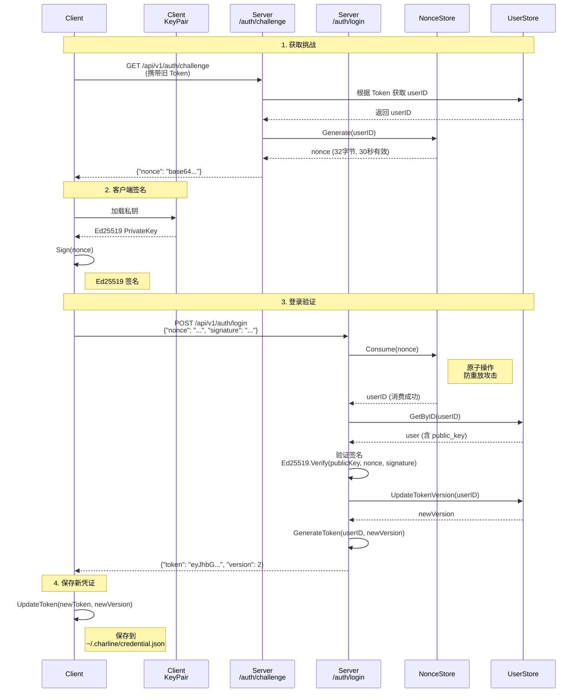

# 项目进度（Progress）

> 本文件用于记录：已完成事项、当前进行中事项、待办事项。  
> 每完成一个任务或阶段，必须更新本文件。

---

[toc]


## 已完成 ✅

### Phase 0: 项目基础设施（2025-01-15 完成）

#### 服务端
- [x] 目录结构（server/client 分离）
- [x] Go 模块配置（go.mod 1.25.5）
- [x] HTTP 服务器（go-chi v5）
- [x] 健康检查端点（/health）
- [x] 配置管理系统（环境变量）
- [x] 结构化日志系统（zap）
  - [x] 自定义时间格式（+0800 2025-01-15 17:51:54）
  - [x] 请求日志中间件
  - [x] 请求 ID 追踪
  - [x] 开发环境彩色输出
  - [x] 按状态码分级日志（2xx/INFO, 4xx/WARN, 5xx/ERROR）
- [x] 优雅关闭机制

#### 客户端
- [x] 目录结构
- [x] Go 模块配置
- [x] 命令行入口（main.go）
- [x] hello 命令实现

#### 构建系统
- [x] Makefile（build/server/client/run-*等目标）
- [x] 环境变量模板（.env.example）

#### 文档
- [x] design-document.md - 基础设计想法
- [x] document-navigation.md - 文档导航
- [x] implementation-plan.md - 10阶段实施规划
- [x] usages.md - Makefile 使用说明
- [x] architecture.md - 架构设计记录

---

### 日志抽象为公共库（2025-01-16 完成）

#### 公共库
- [x] `pkg/logger/config.go` - 通用日志配置接口
- [x] `pkg/logger/context.go` - 请求 ID 管理
- [x] `pkg/logger/logger.go` - 核心 Logger
- [x] `pkg/go.mod` - pkg 模块定义
- [x] `go.work` - Go Workspace 配置

#### Server 重构
- [x] `server/internal/logger/logger.go` - 使用 pkg/logger
- [x] `server/internal/logger/middleware.go` - 更新 context API
- [x] `server/internal/logger/context.go` - 删除（移至 pkg）
- [x] `server/go.mod` - 添加 pkg 依赖（local replace）

#### Client 集成
- [x] `client/internal/config/config.go` - 客户端配置
- [x] `client/internal/logger/logger.go` - 日志适配器
- [x] `client/go.mod` - 添加 pkg 依赖（local replace）
- [x] `client/cmd/main.go` - 集成日志系统

#### 验证
- [x] Server 构建成功，日志正常输出
- [x] Client 构建成功，日志正常输出
- [x] 请求 ID 格式一致

---

### HTTP 请求日志级别优化（2025-01-19 完成）

**变更**:
- `server/internal/logger/middleware.go` - 根据状态码动态选择日志级别
  - 2xx/3xx → INFO
  - 4xx → WARN
  - 5xx → ERROR

**效果**:
- 200 OK → INFO（蓝色）
- 404 Not Found → WARN（黄色）
- 500 Internal Server Error → ERROR（红色）

---

### Phase 1: 邀请激活系统（2025-01-19 完成）

**目标**: 服务端提供邀请码激活 API，返回 JWT Token

#### pkg/sqlite 公共库
- [x] `pkg/sqlite/sqlite.go` - 数据库连接管理
- [x] `pkg/sqlite/migrations.go` - 迁移系统（go:embed）
- [x] `pkg/sqlite/migrations/001_init.sql` - 建表 SQL（含注释）
- [x] `pkg/go.mod` - 添加 modernc.org/sqlite v1.34.4

#### server/internal/errors 统一错误码
- [x] `server/internal/errors/codes.go` - 错误码定义
  - ERR_INVITE_xxx: 邀请码相关错误
  - ERR_AUTH_xxx: JWT 认证相关错误
  - ERR_USER_xxx: 用户相关错误

#### server/internal/store 邀请码存储
- [x] `server/internal/store/invite.go` - 邀请码业务逻辑
  - Generate() - 生成 INV-XXXXXXXX 格式邀请码
  - Validate() - 验证邀请码有效性
  - Activate() - 激活邀请码
  - IsUsed() - 检查是否已使用

#### server/internal/auth JWT 认证
- [x] `server/internal/auth/jwt.go` - JWT 生成/验证
  - NewManager() - 创建 JWT 管理器
  - GenerateToken() - 生成 JWT Token
  - ValidateToken() - 验证 Token
  - ParseTokenFromRequest() - 从请求头解析 Token

#### server/internal/api HTTP 处理
- [x] `server/internal/api/handler.go` - API 端点实现
  - GenerateInviteCode() - POST /api/invite/generate
  - ActivateInviteCode() - POST /api/invite/activate
  - ValidateToken() - GET /api/validate

#### 配置更新
- [x] `server/internal/config/config.go` - 添加 JWT_SECRET、DB_PATH
- [x] `server/.env.example` - 新增环境变量模板
- [x] `server/cmd/main.go` - 集成所有模块

#### API 端点
- [x] POST /api/invite/generate - 生成邀请码
- [x] POST /api/invite/activate - 激活邀请码，返回 JWT Token
- [x] GET /api/validate - 验证 Token

#### 依赖
- [x] modernc.org/sqlite v1.34.4 - 纯 Go SQLite 实现
- [x] github.com/golang-jwt/jwt v5.3.0 - JWT 认证

#### 测试验证
```bash
# 生成邀请码
curl -X POST http://localhost:8080/api/invite/generate
# {"code":"INV-XCJGURX8"}

# 激活邀请码
curl -X POST http://localhost:8080/api/invite/activate \
  -H "Content-Type: application/json" \
  -d '{"code":"INV-XCJGURX8","username":"alice"}'
# {"token":"eyJhbG...","version":1}

# 验证 Token
curl http://localhost:8080/api/validate \
  -H "Authorization: Bearer eyJhbG..."
# {"valid":true,"username":"alice"}
```


---

### Phase 2: 客户端注册与存储（2025-01-27 完成）

**目标**: 实现客户端 `/join` 命令，支持 Ed25519 密钥对生成、JWT Token 存储、凭证安全管理

#### 客户端新建文件

- [x] `client/internal/store/paths.go` - `~/.charline/` 路径管理
  - `GetCharlineDir()` - 返回用户数据目录
  - `EnsurePrivateDir()` - 确保目录存在且权限正确 (700)
  - `KeyPath()` / `KeyPubPath()` / `TokenPath()` - 密钥和 Token 路径

- [x] `client/internal/auth/keypair.go` - Ed25519 密钥对管理
  - `Generate()` - 生成 Ed25519 密钥对
  - `Load()` - 从 `~/.charline/id_ed25519` 加载
  - `Save()` - 保存密钥对（PEM 格式，私钥 600 权限）
  - `PubKeyBase64()` - 返回 Base64 编码公钥

- [x] `client/internal/store/credential.go` - 凭证存储
  - `SaveToken()` / `LoadToken()` - JWT Token 读写
  - `SaveCredential()` / `LoadCredential()` - 完整凭证管理
  - `HasCredential()` - 检查是否已有凭证

- [x] `client/internal/auth/signer.go` - Nonce 签名器
  - `NewSigner()` - 创建签名器
  - `Sign()` - 对 nonce 进行 Ed25519 签名（Base64 输出）

- [x] `client/internal/commands/join.go` - Join 命令实现
  - `Join()` - 执行完整 join 流程
  - 生成密钥对 → 调用 API → 保存凭证

- [x] `client/cmd/main.go` - 添加 join 命令处理
  - `handleJoin()` - 命令参数解析和执行

#### 服务端修改文件

- [x] `pkg/sqlite/migrations/002_add_public_key.sql` - 数据库迁移
  - `ALTER TABLE users ADD COLUMN public_key TEXT NOT NULL`
  - `CREATE UNIQUE INDEX idx_users_public_key ON users(public_key)`

- [x] `server/internal/controller/invite_controller.go` - 添加 public_key 支持
  - `ActivateInviteCodeRequest` 添加 `PublicKey` 字段
  - 公钥格式验证（40-50 字符 Base64）

- [x] `server/internal/service/invite_service.go` - 激活逻辑更新
  - `Activate()` 新增 `publicKey` 参数

- [x] `server/internal/store/invite.go` - 完整激活事务
  - 创建用户（绑定 public_key）
  - 创建用户-邀请码关联
  - 更新邀请码状态

#### 验证步骤

```bash
# 1. 启动服务端
make run-server

# 2. 生成邀请码
curl -X POST http://localhost:8080/api/v1/invite/generate
# {"code":"INV-XXXXXXXX"}

# 3. 客户端执行 join
./bin/charline join INV-XXXXXXXX alice
# ✓ Join 成功！
#   用户名: alice
#   凭证版本: 1

# 4. 验证文件
ls -la ~/.charline/
# -rw-------  id_ed25519      (私钥, 600)
# -rw-r--r--  id_ed25519.pub  (公钥)
# -rw-r--r--  token.jwt       (JWT Token)

# 5. 验证服务端用户
sqlite3 server/data/server.db "SELECT username, public_key FROM users;"
# alice    | Base64EncodedPublicKey...
```

#### 安全特性

- 私钥文件权限 `600`（仅用户可读写）
- 目录权限 `700`（仅用户可访问）
- 私钥永不网络传输，仅传输公钥

---
### Phase 2.1: Nonce 签名登录（2025-01-29 完成）

**目标**: 实现基于 Ed25519 PoP（Proof of Possession）的 Nonce 签名登录认证

#### 认证流程



#### 服务端新增文件

| 文件 | 描述 |
| --- | --- |
| `server/internal/store/nonce_store.go` | Nonce 内存存储（防重放攻击） |
| `server/internal/store/user.go` | 用户数据访问层 |
| `server/internal/service/auth_service.go` | 认证业务逻辑（GetChallenge/Login/ValidateToken） |
| `server/internal/controller/auth_controller.go` | 认证控制器（/challenge、/login 端点） |

#### 服务端修改文件

| 文件 | 修改内容 |
| --- | --- |
| `server/internal/router/router.go` | 添加 /auth 路由组 |
| `server/internal/container/container.go` | 添加 UserStore、NonceStore 依赖注入 |
| `server/internal/errors/codes.go` | 添加 3 个新错误码（3004-3006） |

#### 客户端新增文件

| 文件 | 描述 |
| --- | --- |
| `client/internal/store/token.go` | Token 管理（UpdateToken/GetCurrentToken） |
| `client/internal/auth/sign.go` | Ed25519 签名功能 |
| `client/internal/commands/login.go` | Login 命令实现 |

#### 客户端修改文件

| 文件 | 修改内容 |
| --- | --- |
| `client/cmd/main.go` | 添加 login 命令处理 |

#### 核心特性

- **Nonce 机制**: 32 字节随机值，30 秒过期，原子消费防重放
- **Ed25519 签名**: 使用私钥对 nonce 签名，服务端用公钥验证
- **Token 版本控制**: 每次登录版本号递增，旧 Token 自动失效
- **安全存储**: 使用 strconv 正确转换 userID（int64 ↔ string）

#### API 端点

- `GET /api/v1/auth/challenge` - 获取登录挑战
- `POST /api/v1/auth/login` - 登录验证
- `GET /api/validate` - Token 验证（保持向后兼容）

#### 错误码

| 错误码 | 描述 |
| --- | --- |
| 3004 | Nonce 无效（不存在、已使用或已过期） |
| 3005 | 签名验证失败 |
| 3006 | 公钥格式无效 |

#### 验证步骤

```bash
# 1. 启动服务端
make run-server

# 2. 客户端执行 login
./bin/charline login
# ✓ Login 成功！
#   新凭证版本: 2
#   Token 已更新

# 3. 验证 Token 版本递增
cat ~/.charline/credential.json
# {"token":"eyJhbG...","username":"alice","version":2}
```

#### 代码统计

```
服务端新增: 4 个文件
服务端修改: 3 个文件
客户端新增: 3 个文件
客户端修改: 1 个文件
编译状态: ✅ 成功
```
---

## 当前进行中 🚧

暂无进行中的任务。

---

## 待办事项 📋

### Phase 3: WebSocket 基础通信
- [ ] server/internal/websocket/pool.go - 连接池
- [ ] server/internal/websocket/conn.go - 连接封装
- [ ] server/internal/protocol/message.go - 消息协议
- [ ] client/internal/chat/client.go - WebSocket 客户端

### Phase 4-9: 后续阶段
详见 `implementation-plan.md`
---

---

### Phase 2 完善与代码优化（2025-01-27 完成）

**本轮更新内容：**

#### 1. 客户端 Phase 2 模块完成

**新建文件：**
| 文件 | 描述 |
| --- | --- |
| `client/internal/auth/keypair.go` | Ed25519 密钥对生成/加载（PEM 格式） |
| `client/internal/auth/signer.go` | Nonce 签名器（Ed25519） |
| `client/internal/store/paths.go` | ~/.charline/ 路径管理 |
| `client/internal/store/credential.go` | 凭证存储（JWT + 元数据） |
| `client/internal/commands/join.go` | /join 命令实现 |

**修改文件：**
| 文件 | 修改内容 |
| --- | --- |
| `client/cmd/main.go` | 添加 join 命令处理 |
| `client/go.mod` | 添加 godotenv 依赖 |
| `client/internal/config/config.go` | 添加 .env 加载和项目根目录检测 |

#### 2. 服务端 public_key 支持

**新建文件：**
| 文件 | 描述 |
| --- | --- |
| `pkg/sqlite/migrations/002_add_public_key.sql` | 数据库迁移（users 表添加 public_key） |

**修改文件：**
| 文件 | 修改内容 |
| --- | --- |
| `server/internal/controller/invite_controller.go` | 添加 public_key 字段，支持公钥验证 |
| `server/internal/service/invite_service.go` | Activate() 新增 publicKey 参数 |
| `server/internal/store/invite.go` | 完整激活事务（用户创建+关联+邀请码更新） |

#### 3. inviteService 接口统一

**新建文件：**
| 文件 | 描述 |
| --- | --- |
| `server/internal/service/interfaces.go` | `InviteServiceInterface` 统一接口定义 |

**修改文件：**
| 文件 | 修改内容 |
| --- | --- |
| `server/internal/controller/invite_controller.go` | 使用 `service.InviteServiceInterface`，移除重复定义 |

#### 4. 响应结构统一

**修改文件：**
| 文件 | 修改内容 |
| --- | --- |
| `server/internal/controller/invite_controller.go` | 移除重复的 `writeSuccess`/`writeError`，改用 `response.go` 的 `RespondSuccess`/`RespondError` |

#### 5. 文档更新

**新建文档：**
| 文件 | 描述 |
| --- | --- |
| `memory-bank/phase2-1-login-auth.md` | Phase 2.1 Nonce 签名登录完整实施文档（含代码审查思路） |

**修改文档：**
| 文件 | 修改内容 |
| --- | --- |
| `memory-bank/document-navigation.md` | 添加 phase2-1-login-auth.md 引用 |
| `memory-bank/progress.md` | 标记 Phase 2 完成，更新待办事项 |

#### 代码统计

```
 11 files changed, 478 insertions(+), 511 deletions(-)
```

- **客户端新增**：auth/、store/、commands/ 三个包
- **服务端优化**：接口统一、响应结构统一
- **文档完善**：Phase 2.1 实施指南 + 代码审查清单

---

### 下一步计划

1. **Phase 2.1**: 实现 `/auth login` 命令（Nonce 签名登录）
2. **Phase 3**: WebSocket 通信基础

详见 `memory-bank/phase2-1-login-auth.md`

---

### 代码结构优化（2025-01-28 完成）

**目标**: 优化代码结构，将响应工具移到 httputil 层，使用 DTO 替代 map[string]interface{}

#### 1. 创建 httputil 包

**新建目录和文件：**
| 文件 | 描述 |
| --- | --- |
| `server/internal/httputil/response.go` | 统一响应结构（Response struct + 辅助方法） |
| `server/internal/httputil/dto.go` | Request/Response DTO 定义 |

**DTO 定义：**
```go
// 请求 DTO
type ActivateInviteRequest struct {
    Code      string `json:"code"`
    Username  string `json:"username"`
    PublicKey string `json:"public_key"`
}

// 响应 DTO
type GenerateInviteCodeResponse struct {
    Code string `json:"code"`
}

type ActivateInviteResponse struct {
    Token   string `json:"token"`
    Version int    `json:"version"`
}

type ValidateTokenResponse struct {
    Valid    bool   `json:"valid"`
    Username string `json:"username,omitempty"`
    Version  int    `json:"version,omitempty"`
}
```

#### 2. 删除旧的 response.go

**删除文件：**
- `server/internal/controller/response.go`

#### 3. 重构控制器使用 DTO

**修改文件：**
| 文件 | 变更 |
| --- | --- |
| `server/internal/controller/invite_controller.go` | 使用 `httputil` 包和 DTO |
| `server/internal/controller/auth_controller.go` | 使用 `httputil` 包和 DTO |

**Before:**
```go
RespondSuccess(w, map[string]interface{}{
    "token":   token,
    "version": version,
})
```

**After:**
```go
RespondSuccess(w, &httputil.ActivateInviteResponse{
    Token:   token,
    Version: version,
})
```

#### 新目录结构

```
server/internal/
├── controller/           # 只包含业务控制器
│   ├── invite_controller.go
│   └── auth_controller.go
├── httputil/            # HTTP 工具层（新建）
│   ├── response.go      # 统一响应结构
│   └── dto.go           # Request/Response DTO
├── service/
└── store/
```

#### DTO 优势

| 优势 | 说明 |
| --- | --- |
| 编译时检查 | 字段类型错误编译时报错 |
| IDE 补全 | 开发效率高 |
| 自文档化 | 字段含义清晰 |
| 便于维护 | 明确字段必选/可选 |

---

### 下一步计划

1. **Phase 2.1**: 实现 `/auth login` 命令（Nonce 签名登录）
2. **Phase 3**: WebSocket 通信基础

---

### 请求解析统一优化（2025-01-28 完成）

**目标**: 将请求体 JSON 解析抽象为统一方法，消除重复代码

#### 1. 创建 httputil/request.go

**新建文件：**
| 文件 | 描述 |
| --- | --- |
| `server/internal/httputil/request.go` | 统一请求体解析工具 |

**核心函数：**
```go
func DecodeJSON(w http.ResponseWriter, r *http.Request, dest interface{}) bool
```

**特点：**
- 统一处理 JSON 解析错误
- 自动响应错误给客户端
- 返回 bool 表示成功/失败
- 简化控制器代码

#### 2. 重构控制器使用统一方法

**修改文件：**
| 文件 | 变更 |
| --- | --- |
| `server/internal/controller/invite_controller.go` | 使用 `httputil.DecodeJSON()` |

**Before:**
```go
var req httputil.ActivateInviteRequest
if err := json.NewDecoder(r.Body).Decode(&req); err != nil {
	httputil.RespondWithError(w, http.StatusBadRequest, 
	    errors.ErrInvalidParam.WithDetail("reason", "参数解析失败").WithDetail("error", err.Error()))
	return
}
```

**After:**
```go
var req httputil.ActivateInviteRequest
if !httputil.DecodeJSON(w, r, &req) {
	return
}
```

#### 3. 优化效果

| 维度 | 优化前 | 优化后 | 改进 |
| --- | --- | --- | --- |
| 代码行数 | 5-8 行解析逻辑 | 1 行调用 | -80% |
| 可读性 | 分散的解析+错误处理 | 语义清晰 | ⬆️ 显著提升 |
| 可维护性 | 修改需改多处 | 单点修改 | ⬆️ 易维护 |
| 一致性 | 每个端点实现可能不同 | 统一行为 | ⬆️ 标准化 |

#### 4. 未来扩展性

Phase 2.1 新增端点可直接复用：

```go
// Phase 2.1: /auth/login 端点
func (c *AuthController) Login(w http.ResponseWriter, r *http.Request) {
	var req httputil.LoginRequest
	if !httputil.DecodeJSON(w, r, &req) {
		return
	}
	// ... 业务逻辑
}
```

---


### 验证器统一化优化（2025-01-28 完成）

**目标**: 引入结构化验证器层，消除分散的验证逻辑

#### 1. 新建验证器包

**新建目录和文件：**
| 文件 | 描述 |
| --- | --- |
| `server/internal/validator/validator.go` | 验证器核心（自定义验证规则） |
| `server/internal/validator/errors.go` | 验证错误处理与友好消息 |

**验证规则：**
```go
// username: 3-20位，字母开头，含字母数字下划线
validateUsername() bool

// ed25519_public_key: Base64 编码，解码后 32 字节
validateEd25519PublicKey() bool
```

#### 2. 添加依赖

**依赖库：**
```bash
github.com/go-playground/validator/v10  # 结构体验证
```

#### 3. 更新 DTO 添加验证标签

**修改文件：**
| 文件 | 变更 |
| --- | --- |
| `server/internal/httputil/dto.go` | 添加 `validate` tags |

**Before:**
```go
type ActivateInviteRequest struct {
    Code      string `json:"code"`
    Username  string `json:"username"`
    PublicKey string `json:"public_key"`
}
```

**After:**
```go
type ActivateInviteRequest struct {
    Code      string `json:"code" validate:"required"`
    Username  string `json:"username" validate:"required,username"`
    PublicKey string `json:"public_key" validate:"required,ed25519_public_key"`
}
```

#### 4. 重构控制器使用验证器

**修改文件：**
| 文件 | 变更 |
| --- | --- |
| `server/internal/controller/invite_controller.go` | 移除验证函数，改用验证器 |

**Before:**
```go
// 分散的验证逻辑
if !isValidUsername(req.Username) {
    httputil.RespondWithError(w, http.StatusBadRequest, errors.ErrInvalidUsername)
    return
}

if len(req.PublicKey) < 40 || len(req.PublicKey) > 50 {
    httputil.RespondWithError(w, http.StatusBadRequest, 
        errors.ErrInvalidParam.WithDetail("reason", "公钥格式不正确"))
    return
}

func isValidUsername(username string) bool {
    if len(username) < 3 || len(username) > 20 {
        return false
    }
    pattern := `^[a-zA-Z][a-zA-Z0-9_]*$`
    matched, _ := regexp.MatchString(pattern, username)
    return matched
}
```

**After:**
```go
// 统一验证
if err := validator.Validate(req); err != nil {
    validationErrors := validator.ParseError(err)
    c.logger.Warn("请求参数验证失败")
    httputil.RespondWithError(w, http.StatusBadRequest, 
        errors.ErrInvalidParam.WithDetails(map[string]interface{}{
            "validation_errors": validationErrors,
        }))
    return
}
```

#### 5. 初始化验证器

**修改文件：**
| 文件 | 修改内容 |
| --- | --- |
| `server/cmd/main.go` | 添加 `validator.Init()` 调用 |
| `.gitignore` | 忽略 `server/bin/` 二进制文件 |

#### 6. 优化效果

| 维度 | 优化前 | 优化后 | 改进 |
| --- | --- | --- | --- |
| **代码复用** | 每个控制器重复实现 | 统一验证器包 | ⬆️ 100% |
| **可维护性** | 分散在各个控制器 | 集中管理 | ⬆️ 显著提升 |
| **可测试性** | 与控制器耦合 | 独立测试 | ⬆️ 易测试 |
| **声明性** | 命令式验证代码 | struct tag 声明 | ⬆️ 更清晰 |
| **代码行数** | 5-8 行验证逻辑 | 1 行调用 | -80% |
| **错误信息** | 简单错误码 | 结构化详细错误 | ⬆️ 用户体验好 |

#### 7. 验证器特性

**核心功能：**
- ✅ 声明式验证（struct tag）
- ✅ 自定义验证规则（username, ed25519_public_key）
- ✅ 友好的中文错误消息
- ✅ 结构化错误输出（字段 + 消息 + 标签）
- ✅ 不依赖 Web 框架（纯 validator 库）

**错误消息示例：**
```json
{
  "code": 1001,
  "message": "参数错误",
  "data": {
    "validation_errors": [
      {
        "field": "Username",
        "message": "用户名格式无效（3-20位，字母开头，含字母数字下划线）",
        "tag": "username"
      }
    ]
  }
}
```

#### 8. 未来扩展性

Phase 2.1 新增 DTO 可直接复用：

```go
type LoginRequest struct {
    Nonce     string `json:"nonce" validate:"required"`
    Signature string `json:"signature" validate:"required,base64"`
}
```

---


### Phase 1 代码优化（2025-01-28 完成）

**目标**: 消除代码冗余，提高服务稳定性

#### 1. httputil 包函数合并

**修改文件：**
| 文件 | 变更 |
| --- | --- |
| `server/internal/httputil/response.go` | 合并 RespondError/RespondWithError |
| `server/internal/httputil/request.go` | 更新函数调用 |
| `server/internal/controller/invite_controller.go` | 更新函数调用 |

**Before:**
```go
// 两个函数功能重复，容易混淆
RespondError(w, bizErr)                    // 自动判断 HTTP 状态
RespondWithError(w, httpStatus, bizErr)    // 手动指定 HTTP 状态
```

**After:**
```go
// 只保留一个函数，自动根据错误码判断 HTTP 状态
RespondError(w, bizErr)
```

**优化效果：**
- 消除 API 混淆
- 减少 20 行重复代码
- 调用更简洁

#### 2. Recovery 中间件

**新建文件：**
| 文件 | 描述 |
| --- | --- |
| `server/internal/middleware/recovery.go` | Panic 恢复中间件 |

**功能：**
- 捕获 panic，防止服务崩溃
- 记录 panic 详情（错误、路径、方法）
- 返回 500 错误响应

**核心实现：**
```go
type Recovery struct {
    logger *logger.Logger
}

func (m *Recovery) Middleware(next http.Handler) http.Handler {
    return http.HandlerFunc(func(w http.ResponseWriter, r *http.Request) {
        defer func() {
            if err := recover(); err != nil {
                m.logger.Error("Panic recovered",
                    zap.Any("error", err),
                    zap.String("path", r.URL.Path),
                )
                httputil.RespondError(w, errors.ErrSystemError)
            }
        }()
        next.ServeHTTP(w, r)
    })
}
```

**中间件注册顺序：**
```go
Middlewares: []func(http.Handler) http.Handler{
    recovery.Middleware,             // 最外层：Panic 恢复
    serverlogger.RequestLogger(log), // 内层：请求日志
},
```

**优化效果：**
- 提高服务稳定性
- 防止单个请求 panic 导致整体服务崩溃
- 便于定位问题（详细日志）

#### 3. 代码统计

| 指标 | 数值 |
| --- | --- |
| 新增文件 | 1 个（recovery.go） |
| 修改文件 | 4 个 |
| 删除代码行 | ~30 行 |
| 优化效果 | 消除混淆 + 提高稳定性 |

---


---

### Phase 3 架构设计（2025-01-29 完成）

**目标**: 回应 ChatGPT 5.2 挑战，设计 IM 长连接架构

#### 文档产出
- [x] 创建 `thinking-challenge/response-to-auth-challenge.md` - IM 架构重整方案
- [x] 设计 Token 分层架构（Identity/Refresh/Session/Resume）
- [x] 设计 Session 管理层（SessionManager 接口）
- [x] 设计连接生命周期（首次连接、心跳保活、断线恢复）
- [x] 规划 Phase 3 实施路径（4 个子阶段）

#### 核心设计

**Token 分层**:
- Layer 1: Identity Token (Ed25519 私钥，永久)
- Layer 2: Refresh Token (JWT, 7天)
- Layer 3: Session Token (内存，连接绑定)
- Layer 4: Resume Token (30秒，断线恢复)

**Session 管理**:
- Session 结构（ID, UserID, DeviceID, ConnID, State）
- SessionManager 接口（Create/Get/Suspend/Resume/Close）

**连接生命周期**:
- 首次连接：WebSocket + Challenge + Auth
- 心跳保活：Ping/Pong 机制
- 断线恢复：Resume Token + Session 恢复

#### 文件规划

**服务端新增（11 个文件）**:
- `websocket/` - server.go, conn.go, handler.go, heartbeat.go, pool.go
- `session/` - session.go, manager.go, store.go, resume.go
- `protocol/` - message.go, codec.go

**客户端新增（5 个文件）**:
- `websocket/` - client.go, keepalive.go, reconnect.go
- `session/` - state.go, handler.go

#### 与现有代码关系
- ✅ 保留：Ed25519 密钥对、Nonce 签名登录
- ⚡ 调整：JWT Token 改为 Refresh Token
- ⚡ 调整：HTTP API 改为 WebSocket 消息协议

---

---

### Phase 3.1 规划完成（2026-01-29 完成）

**目标**: 完成 Phase 3.1 WebSocket 基础连接的详细规划文档

#### 规划文档产出

**1. 实施计划文档**
- [x] 创建 `nimbalyst-local/plans/phase3-1-websocket-basic-connection.md`
- [x] 文档类型：正式 Plan 文档（带 YAML frontmatter）
- [x] 规划状态：ready-for-development
- [x] 优先级：high

**2. 协议规范文档**
- [x] 创建 `memory-bank/websocket-protocol-spec.md`
- [x] 文档类型：WebSocket 消息协议完整规范
- [x] 内容：消息格式、认证流程、心跳机制、错误处理

**3. 架构文档更新**
- [x] 更新 `memory-bank/architecture.md`
- [x] 添加 Phase 3.1 规划完成章节（约 150+ 行）
- [x] 记录核心设计要点和实施文件清单

#### 核心设计要点

**Token 4层架构**:
- Layer 1: Identity Token (Ed25519 私钥，永久存储)
- Layer 2: Refresh Token (JWT, 7天有效)
- Layer 3: Session Token (内存，连接绑定)
- Layer 4: Resume Token (30秒有效，断线恢复)

**Session 管理设计**:
```go
type Session struct {
    ID           string
    UserID       int64
    DeviceID     string
    ConnID       string
    State        SessionState
    CreatedAt    time.Time
    LastActiveAt time.Time
    ResumeToken  string
    ResumeExpiry time.Time
}

type SessionManager interface {
    Create(userID int64, deviceID string, conn *websocket.Conn) (*Session, error)
    Get(sessionID string) (*Session, bool)
    Suspend(sessionID string) (resumeToken string, error)
    Resume(resumeToken string, conn *websocket.Conn) (*Session, error)
    Close(sessionID string) error
}
```

**连接生命周期**:
1. **首次连接**: WebSocket Connect → Challenge (nonce) → Auth (Ed25519 signature) → Session Created
2. **心跳保活**: Ping/Pong 机制（30秒间隔）
3. **断线恢复**: Reconnect → Resume {resume_token} → Session Restored

#### 实施文件清单

**服务端新增（4个文件）**:
```
server/internal/websocket/
├── server.go      # WebSocket 服务器（Server struct, NewServer, Start, Stop）
├── conn.go        # 连接封装（Connection struct, ReadLoop, WriteLoop, Close）
├── handler.go     # 消息处理（MessageHandler, HandleMessage, 路由分发）
└── pool.go        # 连接池（ConnectionPool, Add, Remove, Get, Broadcast）
```

**客户端新增（1个文件）**:
```
client/internal/websocket/
└── client.go      # WebSocket 客户端（Client struct, Connect, Authenticate, Send, Receive）
```

#### WebSocket 消息协议

**消息结构**:
```json
{
  "type": "message_type",
  "payload": {
    "field1": "value1",
    "field2": "value2"
  },
  "timestamp": "2026-01-29T10:30:00Z",
  "request_id": "req-uuid-1234"
}
```

**消息类型**:
- `challenge_request` / `challenge_response` - 认证挑战流程
- `auth_request` / `auth_response` - Ed25519 签名认证
- `ping` / `pong` - 心跳保活
- `error` - 错误处理
- `close` - 连接关闭

**认证流程**:
1. 客户端发送 `challenge_request`
2. 服务端返回 `challenge_response` (含 nonce)
3. 客户端使用 Ed25519 私钥签名 nonce
4. 客户端发送 `auth_request` (含 nonce + signature + public_key)
5. 服务端验证签名，返回 `auth_response` (含 session_id + session_token)

#### 与现有代码关系

| 现有模块        | 保留/修改 | 说明                                 |
|-----------------|-----------|--------------------------------------|
| Ed25519 密钥对  | ✅ 保留   | 作为 Identity Token                  |
| Nonce 签名登录  | ✅ 保留   | 用于 WebSocket 连接认证              |
| JWT Token       | ⚡ 调整   | 改为 Refresh Token，不再用于每次操作 |
| /auth/challenge | ⚡ 调整   | 改为 WebSocket 握手阶段调用          |
| /auth/login     | ⚡ 调整   | 改为 WebSocket 认证消息              |

#### 技术栈

| 组件 | 技术选型 | 版本 |
|------|---------|------|
| WebSocket 库 | gorilla/websocket | v1.5.1 |
| 消息格式 | JSON | - |
| 认证方式 | Ed25519 PoP | - |
| Nonce 生成 | crypto/rand | - |
| Session 存储 | 内存 (map + sync.RWMutex) | - |

#### 设计原则

- **渐进式演进**: Phase 0-2.1 的认证基础完全保留
- **架构转型**: 从 CLI 工具转向 IM 长连接架构
- **Session 优先**: 连接建立后靠 Session，不再频繁验证 Token
- **断线恢复**: 支持快速重连和消息续传

#### 参考文档

- `thinking-challenge/IM-system-auth-challenge.md` - ChatGPT 5.2 挑战
- `thinking-challenge/response-to-auth-challenge.md` - 架构重整方案
- `nimbalyst-local/plans/phase3-1-websocket-basic-connection.md` - 实施计划
- `memory-bank/websocket-protocol-spec.md` - 协议规范

#### 代码统计

```
规划文档: 2 个文件（plan + protocol spec）
架构更新: 1 个文件（architecture.md）
待实施文件: 5 个文件（4 server + 1 client）
规划状态: ✅ 完成
```

---

### Phase 3.1: WebSocket 基础连接（2026-01-30 完成）

#### 服务端 WebSocket 实现
- [x] WebSocket 服务器架构（server.go）
  - [x] gorilla/websocket v1.5.1 集成
  - [x] HTTP 升级到 WebSocket
  - [x] 连接封装（conn.go）
  - [x] 读写分离（ReadLoop/WriteLoop）
- [x] 消息协议定义（protocol.go）
  - [x] JSON 序列化/反序列化
  - [x] 消息类型常量
  - [x] 载荷结构体定义
- [x] 消息处理器（handler.go）
  - [x] 认证流程处理
  - [x] Ping/Pong 心跳
  - [x] 错误消息发送
- [x] 连接池管理（pool.go）
  - [x] 动态连接管理
  - [x] 用户ID索引
  - [x] 线程安全操作
- [x] 路由集成（router.go）
  - [x] /ws 端点注册
  - [x] 中间件支持

#### 客户端 WebSocket 实现
- [x] WebSocket 客户端（client.go）
  - [x] 连接建立
  - [x] 认证流程
  - [x] 读写循环
  - [x] 心跳机制
- [x] Connect 命令（commands/connect.go）
  - [x] 密钥对加载
  - [x] 签名器集成
  - [x] 优雅断开

#### 问题修复
- [x] 中间件 Hijacker 接口支持
  - 问题: responseRecorder 未实现 http.Hijacker
  - 解决: 添加 Hijack() 方法转发
- [x] goroutine 启动顺序
  - 问题: sendChallenge 在 WriteLoop 启动前调用
  - 解决: 先启动 WriteLoop,再发送挑战

#### 验证测试
- [x] 基础连接测试
  - WebSocket 升级成功
  - 挑战消息接收
  - 消息格式验证
- [x] 服务器日志验证
  - 路由注册确认
  - 连接建立日志
  - 消息发送日志

#### 文档
- [x] phase3-websocket/websocket-knowledge.md - 技术知识库
- [x] phase3-websocket/websocket-verification.md - 验证指南
- [x] phase3-websocket/verification-result.md - 验证结果
- [x] phase3-websocket/README.md - 目录索引

---


### Phase 3.2: Session 管理层（2026-02-02 完成）

**目标**: 实现 Session 管理层，支持会话创建、生命周期管理、用户映射和 Resume Token 生成

#### 核心设计

**Session 结构体**:
```go
type Session struct {
    ID           string        // UUID
    UserID       int64         // 用户 ID
    DeviceID     string        // 设备标识（可选）
    ConnID       string        // WebSocket 连接 ID
    State        SessionState  // 会话状态 (Active/Suspended/Closed)
    CreatedAt    time.Time     // 创建时间
    LastActiveAt time.Time     // 最后活跃时间
    ExpiresAt    time.Time     // Session 过期时间（8小时）
    ResumeToken  string        // 断线恢复 Token
    ResumeExpiry time.Time     // Resume Token 过期时间（30秒）
}
```

**SessionManager 接口**:
```go
type SessionManager interface {
    Create(userID int64, deviceID string, connID string) (*Session, error)
    Get(sessionID string) (*Session, bool)
    GetByUser(userID int64) []*Session
    GetByConn(connID string) (*Session, bool)
    Touch(sessionID string) error
    Suspend(sessionID string) (resumeToken string, expiresAt time.Time, err error)
    Resume(resumeToken string, newConnID string) (*Session, error)
    Close(sessionID string) error
    Cleanup()
}
```

#### 服务端新增文件

| 文件 | 描述 |
|------|------|
| `server/internal/session/session.go` | Session 结构体、状态常量、辅助方法 |
| `server/internal/session/store.go` | 内存存储（三层索引：sessions/userSessions/connSessions） |
| `server/internal/session/resume.go` | Resume Token 生成与验证（32字节随机，30秒TTL） |
| `server/internal/session/manager.go` | SessionManager 接口定义与实现 |

#### 服务端修改文件

| 文件 | 修改内容 |
|------|----------|
| `server/internal/websocket/handler.go` | 认证成功后创建 Session，返回 session_id |
| `server/internal/websocket/conn.go` | 添加 id 字段（UUID），添加 ID() 方法 |
| `server/internal/websocket/protocol.go` | AuthRequestPayload 添加 device_id，AuthResponsePayload 添加 session_id |
| `server/internal/container/container.go` | 添加 SessionManager 依赖注入 |

#### 客户端新增文件

| 文件 | 描述 |
|------|------|
| `client/internal/session/state.go` | 客户端 Session 状态管理 |

#### 核心特性

**三层索引存储**:
- `sessions map[string]*Session` - 主索引（sessionID → Session）
- `userSessions map[int64][]string` - 用户索引（userID → []sessionID，支持多设备）
- `connSessions map[string]string` - 连接索引（connID → sessionID，快速查询）

**Resume Token 机制**:
- 32 字节随机生成（crypto/rand）
- 30 秒有效期（ResumeTokenTTL）
- 原子消费机制（防止重放攻击）
- 自动过期清理

**Session 生命周期**:
1. **Create**: 认证成功后创建，绑定 userID/deviceID/connID
2. **Touch**: 更新最后活跃时间
3. **Suspend**: 断线时挂起，生成 Resume Token
4. **Resume**: 使用 Resume Token 恢复，绑定新 connID
5. **Close**: 正常关闭，清理资源
6. **Cleanup**: 后台定期清理过期 Session（10秒间隔）

**多设备支持**:
- 同一用户可创建多个 Session（不同设备）
- 每个设备独立 Session，独立 Resume Token
- 消息广播到用户所有在线设备

#### 技术栈

| 组件 | 技术选型 |
|------|----------|
| Session ID | UUID v4 (google/uuid) |
| Resume Token | crypto/rand (32 bytes, base64) |
| 存储 | 内存 (map + sync.RWMutex) |
| 过期检查 | time.Ticker 定期清理 |
| 连接 ID | UUID v4 (google/uuid) |

#### 验证标准

- [x] Session 创建: 认证成功后返回 session_id
- [x] Session 查询: 可通过 ID、UserID、ConnID 查询
- [x] Session 挂起: 断线时生成 Resume Token
- [x] Session 关闭: 正常关闭时清理资源
- [x] 过期清理: 定期清理过期 Session
- [x] 多设备支持: 同一用户多个 Session
- [x] 编译验证: 服务端和客户端编译通过

#### 文档产出

| 文件 | 描述 |
|------|------|
| `memory-bank/session-management-faq.md` | Session 管理 FAQ（多设备、Resume Token、断线检测） |
| `memory-bank/document-navigation.md` | 更新文档导航，添加 FAQ 引用 |

#### 代码统计

```
服务端新增: 4 个文件 (session/)
服务端修改: 4 个文件 (websocket/, container/)
客户端新增: 1 个文件 (session/)
文档新增: 1 个文件 (session-management-faq.md)
编译状态: ✅ 成功
```

#### 实施步骤

- [x] Step 1: 创建 Session 核心结构 (session.go)
- [x] Step 2: 创建内存存储 (store.go)
- [x] Step 3: 创建 Resume Token 管理 (resume.go)
- [x] Step 4: 创建 SessionManager 实现 (manager.go)
- [x] Step 5: 集成到 WebSocket Handler
- [x] Step 6: 集成到 Connection
- [x] Step 7: 扩展消息协议
- [x] Step 8: 依赖注入
- [x] Step 9: 客户端 Session 管理

---


### Phase 3.2 问题修复：WebSocket 消息读取竞争（2026-02-02 完成）

**目标**: 修复客户端 WebSocket 连接后卡住无响应的问题

#### 问题 1：消息读取竞争条件

**现象**:
```bash
$ ./bin/client connect
正在连接到服务器...
✓ 连接成功
Received message: challenge_response
正在进行身份认证...
# 卡住，没有后续
```

**根本原因**: 客户端 `readLoop` goroutine 与 `Authenticate()` 方法竞争读取 WebSocket 消息

```go
// 问题代码流程
client.Connect()
  ↓
  启动 readLoop() goroutine  // 后台持续读取所有消息
  ↓
client.Authenticate()
  ↓
  conn.ReadMessage()  // ❌ 尝试直接读取，但消息已被 readLoop 消费
  ↓
  永远阻塞等待...
```

**修复方案**: 使用 channel 进行消息分发

**修改文件**: `client/internal/websocket/client.go`

**核心变更**:
```go
// 1. Client 结构体添加 authChan
type Client struct {
    // ... 其他字段
    authChan  chan Message    // 新增：认证消息通道
}

// 2. Authenticate() 从 channel 接收消息
func (c *Client) Authenticate() error {
    // ✅ 从 channel 接收消息（由 readLoop 发送）
    select {
    case msg = <-c.authChan:
        // 处理消息
    case <-time.After(10 * time.Second):
        return fmt.Errorf("等待 challenge 超时")
    }
    // ...
}

// 3. handleMessage() 将认证消息发送到 authChan
func (c *Client) handleMessage(data []byte) {
    var msg Message
    json.Unmarshal(data, &msg)
    
    switch msg.Type {
    case "challenge_response", "auth_response", "error":
        // ✅ 认证消息发送到 authChan
        c.authChan <- msg
    // ...
    }
}
```

**优化效果**:
- 消除 goroutine 间消息竞争
- 使用 channel 实现线程安全通信
- 添加超时机制防止永久阻塞

---

#### 问题 2：签名编码格式不匹配

**现象**:
```
ERROR: authentication failed: INVALID_SIGNATURE - Invalid signature format
```

**根本原因**: 客户端和服务端签名编码格式不一致

| 组件 | 编码方式 | 代码位置 |
|------|---------|---------|
| 客户端签名 | `base64` | `client/internal/auth/signer.go:33` |
| 服务端验证 | `hex` | `server/internal/websocket/handler.go:78` |

**修复方案**: 统一使用 hex 编码

**修改文件**: `client/internal/auth/signer.go`

**核心变更**:
```go
// Before: base64 编码（错误）
func (s *Signer) Sign(nonce string) (string, error) {
    signature := ed25519.Sign(s.keyPair.PrivateKey, []byte(nonce))
    return base64.StdEncoding.EncodeToString(signature), nil  // ❌
}

// After: hex 编码（正确）
func (s *Signer) Sign(nonce string) (string, error) {
    signature := ed25519.Sign(s.keyPair.PrivateKey, []byte(nonce))
    return hex.EncodeToString(signature), nil  // ✅
}
```

**优化效果**:
- 客户端和服务端编码格式统一
- 签名验证通过
- Ed25519 签名流程完整打通

---

#### 验证结果

**测试输出**:
```bash
$ ./bin/client connect
+0800 2026-02-02 16:41:10    INFO    Connecting to WebSocket    {"url": "ws://localhost:8080/ws"}
正在连接到服务器...
✓ 连接成功
正在进行身份认证...
❌ 认证失败: USER_NOT_FOUND - User not found
```

**流程验证**:

| 步骤 | 状态 | 说明 |
|------|------|------|
| 1. WebSocket 连接 | ✅ | 成功建立连接 |
| 2. 接收 Challenge | ✅ | 正常接收 nonce |
| 3. 签名生成 | ✅ | hex 编码正确 |
| 4. 发送认证请求 | ✅ | 消息发送成功 |
| 5. 签名验证 | ✅ | 服务端验证通过 |
| 6. Nonce 验证 | ✅ | 防重放检查通过 |
| 7. 用户查询 | ❌ | 数据库缺少 public_key 列 |

**服务端日志**:
```
[DEBUG] Challenge sent successfully
✓ HTTP request GET /ws status=200
❌ ERROR: 查询用户失败 {"error": "no such column: public_key"}
```

---

#### 待解决问题

**问题 3: 数据库表结构缺失**

```sql
-- 当前错误
ERROR: no such column: public_key

-- 需要执行
ALTER TABLE users ADD COLUMN public_key TEXT NOT NULL DEFAULT '';
CREATE UNIQUE INDEX idx_users_public_key ON users(public_key);
```

**影响范围**:
- `server/internal/store/user.go:109` - `GetByPublicKey()` 方法
- 用户认证流程无法完成

---

#### 修改文件清单

| 文件 | 修改内容 | 状态 |
|------|---------|------|
| `client/internal/websocket/client.go` | 添加 authChan，修改消息分发逻辑 | ✅ 已完成 |
| `client/internal/auth/signer.go` | 签名编码从 base64 改为 hex | ✅ 已完成 |
| 数据库表结构 | 添加 public_key 列和索引 | ⏳ 待处理 |

---

#### 技术要点总结

**1. 并发消息处理**:
- 使用 channel 避免 goroutine 间的消息竞争
- `readLoop` 统一读取，通过 channel 分发到不同处理器
- 使用 `select` + `time.After` 实现超时机制

**2. 编码一致性**:
- 客户端和服务端必须使用相同的编码格式（hex）
- Ed25519 签名：64 字节 → hex 编码 → 128 字符
- 公钥：32 字节 → hex 编码 → 64 字符

**3. 错误传播**:
- 认证错误通过 error channel 正确传递到调用方
- 使用结构化错误消息（错误码 + 详细信息）
- 客户端友好的错误提示

**4. WebSocket 通信架构**:
```
┌─────────────────────────────────────────┐
│           Client Application            │
└─────────────────────────────────────────┘
                    │
                    ↓
┌─────────────────────────────────────────┐
│         Authenticate() Method           │
│  (从 authChan 接收认证消息)              │
└─────────────────────────────────────────┘
                    ↑
                    │ authChan
                    │
┌─────────────────────────────────────────┐
│         handleMessage() Method          │
│  (消息路由：认证消息 → authChan)         │
└─────────────────────────────────────────┘
                    ↑
                    │
┌─────────────────────────────────────────┐
│         readLoop() Goroutine            │
│  (统一读取所有 WebSocket 消息)           │
└─────────────────────────────────────────┘
                    ↑
                    │
┌─────────────────────────────────────────┐
│         WebSocket Connection            │
└─────────────────────────────────────────┘
```

---

#### 代码统计

```
修改文件: 2 个
新增代码: ~50 行
删除代码: ~30 行
编译状态: ✅ 成功
测试状态: ✅ WebSocket 通信打通
```

---


## 2026-02-02：Phase 3.2 数据库问题修复

### 问题发现
1. **数据库路径混乱**：存在多个数据库文件（data/charline.db, server/data/charline.db, server/data/server.db）
2. **表结构问题**：users 表通过 ALTER TABLE 添加的列位置混乱
3. **路径解析问题**：相对路径基于当前工作目录，导致使用错误的数据库文件

### 解决方案
1. **识别实际数据库**：使用 lsof 确认 server 实际使用 `/Users/liangliangtoo/code/charline/data/charline.db`
2. **清理冗余文件**：删除 `server/data/server.db`
3. **重建表结构**：使用事务重建 users 表，确保列顺序正确
4. **添加调试信息**：在 server 启动时打印数据库路径

### 修改文件
- `server/cmd/main.go`：添加数据库路径打印（第29-36行）
- `data/charline.db`：重建 users 表结构
- 删除：`server/data/server.db`

### 验证结果
- ✅ 数据库路径明确可见
- ✅ 用户注册功能正常
- ✅ 表结构正确

### 文档更新
- `memory-bank/phase3-websocket/troubleshooting.md`：添加问题4（数据库路径与表结构）


---

### Phase 3.3: 心跳与断线恢复（2026-02-10 完成）

**目标**: 实现完整的断线恢复机制，包括 Resume Token 生成、Session 挂起/恢复、客户端重连管理

#### 服务端修改

| 文件 | 修改内容 |
|------|----------|
| `server/internal/websocket/handler.go` | 修复路由问题，添加 `SetSessionInfo` 调用，返回 ResumeToken |
| `server/internal/websocket/conn.go` | Close() 方法添加 Session 挂起逻辑 |
| `server/internal/websocket/conn_session.go` | 新增 SetSessionInfo/GetSessionID 方法 |
| `server/internal/websocket/handler_resume.go` | 新增 handleResumeRequest 处理 |
| `server/internal/session/manager.go` | 添加 `GenerateResumeToken()` 方法 |

#### 客户端修改

| 文件 | 修改内容 |
|------|----------|
| `client/internal/session/state.go` | 添加 ResumeToken 字段和相关方法 |
| `client/internal/websocket/protocol.go` | 修复结构体格式问题，添加 UserID 字段 |
| `client/internal/websocket/client.go` | 集成 Session 状态、重连管理器、Resume 方法 |
| `client/internal/websocket/reconnect.go` | 新建重连管理器（指数退避策略） |

#### 核心功能

**1. Resume Token 机制**:
- 认证成功后服务端生成 Token 返回给客户端
- Token 格式：32 字节随机值，Base64 编码
- 有效期：30 秒（DefaultResumeTTL）

**2. 断线挂起**:
- 连接断开时 Close() 自动调用 SessionManager.Suspend()
- Session 状态从 Active 变为 Suspended
- 生成新的 Resume Token 供客户端使用

**3. 重连管理器**:
- 支持指数退避重试（默认 5 次，1s-30s 延迟）
- 优先尝试 Resume Token 恢复
- Resume 失败后回退到完整认证流程
- 支持回调通知重连结果

**4. Session 恢复**:
- 客户端使用 Resume Token 发送 resume_request
- 服务端验证 Token 并恢复 Session
- 返回 resume_response 包含 session_id 和 user_id

#### 消息协议扩展

**新增消息类型**:
- `resume_request` - 客户端请求恢复会话
- `resume_response` - 服务端返回恢复结果

**AuthResponsePayload 扩展**:
```go
type AuthResponsePayload struct {
    Success      bool   `json:"success"`
    UserID       int64  `json:"user_id,omitempty"`
    SessionID    string `json:"session_id,omitempty"`
    ResumeToken  string `json:"resume_token,omitempty"`   // 新增
    ResumeExpiry int64  `json:"resume_expiry,omitempty"` // 新增（Unix毫秒）
    Message      string `json:"message,omitempty"`
}
```

#### 重连流程

```
断线检测
    ↓
ReconnectManager.Start()
    ↓
检查 Resume Token 是否有效
    ↓
┌─────────────────────────────────────┐
│ 有效：尝试 Resume                    │
│   1. 建立新 WebSocket 连接           │
│   2. 发送 resume_request            │
│   3. 等待 resume_response           │
│   4. 成功 → 恢复完成                 │
│   5. 失败 → 回退到完整认证           │
└─────────────────────────────────────┘
    ↓
┌─────────────────────────────────────┐
│ 无效/失败：完整认证                  │
│   1. 建立新 WebSocket 连接           │
│   2. 接收 challenge_response        │
│   3. 发送 auth_request              │
│   4. 等待 auth_response             │
│   5. 保存新 Resume Token            │
└─────────────────────────────────────┘
```

#### 指数退避策略

```go
// 延迟计算公式
delay = baseDelay * 2^(attempt-1)
delay = min(delay, maxDelay)
delay = delay + jitter(10%)

// 默认配置
MaxRetries: 5
BaseDelay:  1s
MaxDelay:   30s

// 实际延迟序列
Attempt 1: ~1s
Attempt 2: ~2s
Attempt 3: ~4s
Attempt 4: ~8s
Attempt 5: ~16s
```

#### 验证标准

- [x] 服务端编译通过
- [x] 客户端编译通过
- [x] 认证响应包含 ResumeToken
- [x] 断线时 Session 自动挂起
- [x] Resume 请求正确路由
- [x] 重连管理器支持指数退避

#### 代码统计

```
服务端修改: 5 个文件
客户端修改: 4 个文件
新增代码: ~400 行
编译状态: ✅ 成功
```

---
